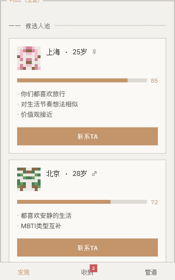
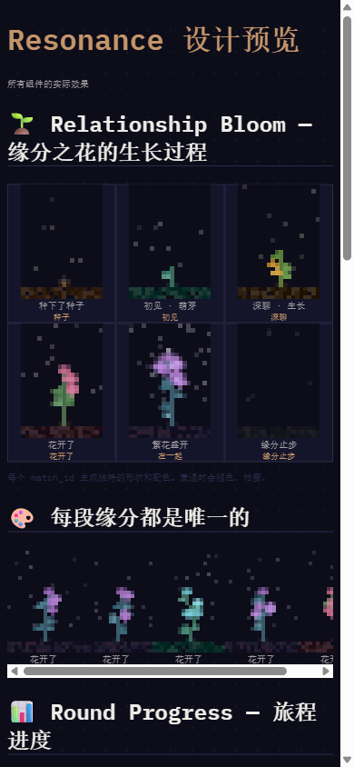

# Resonance (共振)

A structured dating web app with a Ghibli-inspired pixel-art look. Instead of endless swiping, an AI agent curates a small daily pool of candidates, and each match moves through staged rounds built on Arthur Aron's 36 progressive questions.

**Status: frozen.** The design and the MVP implementation are complete, but the app was never launched. The repository is kept as a portfolio piece and is not under active development.

| Candidate pool | Relationship bloom |
|---|---|
|  |  |

## What it does

Users build a profile and describe what they want in a partner. Every day the AI curates a ranked pool of up to twenty candidates, each shown with a pixel avatar, a fit score and three short reasons; real photos are revealed only after both people finish the first round. Reaching out costs a small fee, which is meant to make interest a real signal. A match then progresses through three rounds (an optional first call, an in-person date, meeting friends), and each match is represented by a pixel plant that grows, blooms or withers as the relationship moves forward. Bazi, MBTI and zodiac are optional profile enrichments and are never required for matching.

The full product rationale is in [docs/superpowers/specs/2026-06-03-resonance-redesign-design.md](docs/superpowers/specs/2026-06-03-resonance-redesign-design.md), and the visual system is in [docs/frontend-design-spec.md](docs/frontend-design-spec.md). Four alternative visual directions that were explored are in [docs/demos/](docs/demos/).

## Stack

The backend is FastAPI with async SQLAlchemy on PostgreSQL, Redis for sessions and OTP codes, and an ARQ worker for background jobs. The Claude API powers pool curation, question selection, approach messages and session recaps. SMS login and photo storage use Tencent Cloud. The frontend in `frontend/` is a mobile-first Next.js app with Tailwind and zustand; `resonance-frontend/` is an alternative UI draft kept for reference.

## Running locally

Start PostgreSQL and Redis:

```
docker compose up -d
```

Run the backend (developed on Python 3.12) from `backend/`:

```
pip install -r requirements.txt
uvicorn main:app --reload
```

The ARQ worker runs with `arq workers.arq_worker.WorkerSettings`, and tests run with `pytest`. Environment variables are listed in [docs/deploy.md](docs/deploy.md). Alembic is configured but no migration scripts were written before the project was frozen; the test fixtures create the schema from the SQLAlchemy models, and a fresh database needs the same step (or a first migration) before the API can serve requests.

Run the frontend from `frontend/`, after copying `.env.local.example` to `.env.local`:

```
npm install
npm run dev
```

## License

MIT, see [LICENSE](LICENSE).
